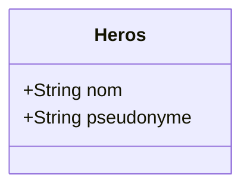
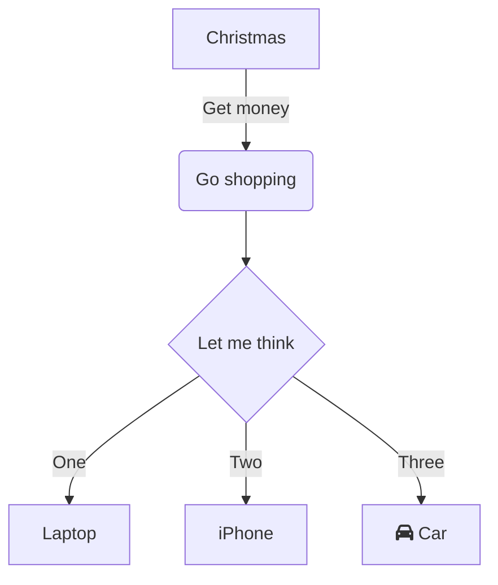

```mermaid

usecase-beta
actor User("User")
actor Admin("Administrator")
Login("Log in")
ViewProfile("View profile")
ManageUsers("Manage users")
ViewReports("View reports")
User --> Login
User --> ViewProfile
Admin --> ManageUsers
Admin --> ViewReports

```