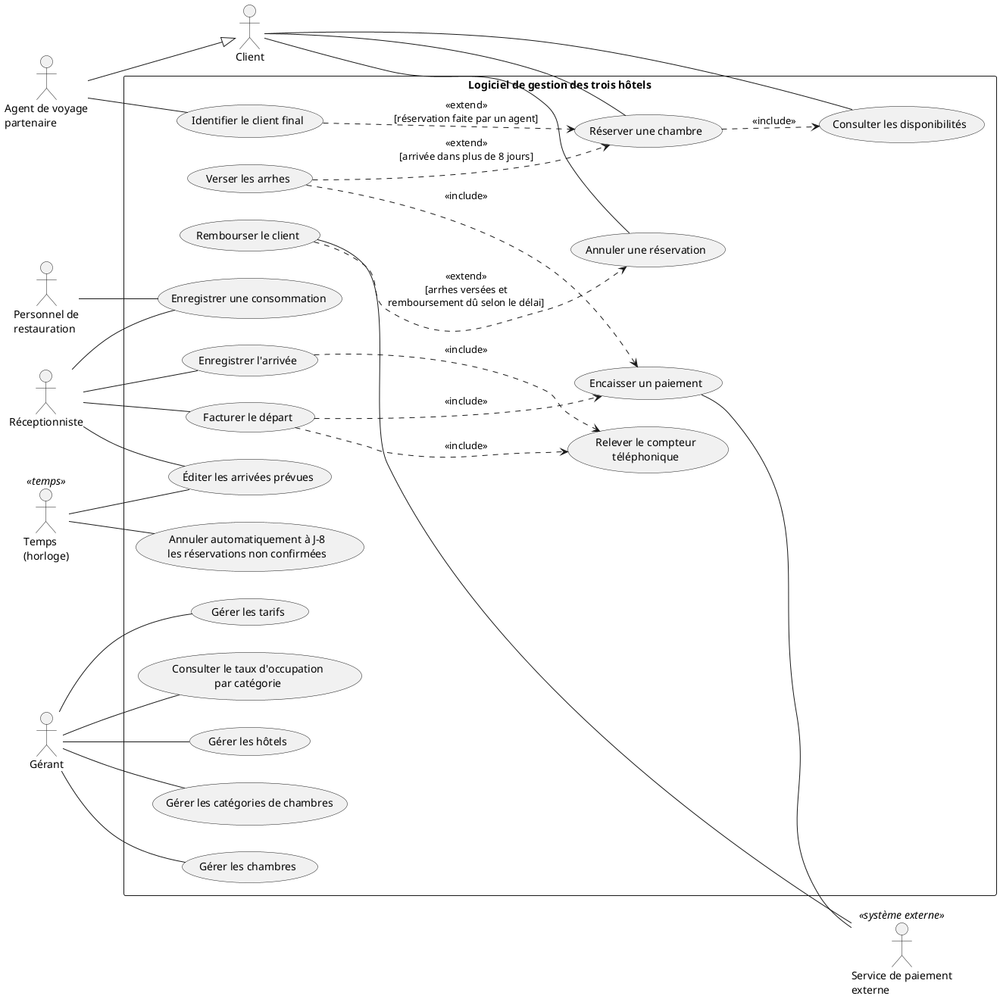

# Atelier UML – Diagramme Use Case

**B2 EPSI – 2026-2027**
**Équipe :** _(noms des 3-4 membres à compléter)_

Système modélisé : logiciel unique d'une PME qui gère **trois hôtels** de 30 à 80 chambres (catégories de chambres + petit restaurant par hôtel).

---

## 1. Les acteurs

| Rôle | Nature | Ce qu'il attend du système |
|---|---|---|
| **Client** | Humain (principal) | Consulter les disponibilités, réserver une chambre en ligne, verser des arrhes, annuler lui-même avec un remboursement selon le délai, recevoir une facture claire à son départ. |
| **Agent de voyage partenaire** | Humain (principal) | Faire les mêmes opérations que le client (consulter, réserver, annuler), mais **pour le compte d'un client**, depuis un compte partenaire identifié. |
| **Réceptionniste** | Humain (principal) | Enregistrer l'arrivée (clés, compteur téléphonique), saisir les consommations, facturer et encaisser au départ, disposer de la liste des arrivées prévues chaque matin. |
| **Personnel de restauration** (serveur / barman) | Humain (secondaire) | Imputer rapidement les consommations du restaurant et du bar sur le séjour d'un client. |
| **Gérant** | Humain (principal) | Administrer hôtels, catégories, chambres et tarifs ; suivre le taux d'occupation par catégorie sur une période. |
| **Service de paiement externe** | Système externe | Recevoir des demandes d'encaissement (arrhes, solde) ou de remboursement et renvoyer un résultat fiable (accepté / refusé). |
| **Temps** (horloge / planificateur) | Temps | Déclencher automatiquement, sans intervention humaine, l'annulation à J-8 des réservations non confirmées et l'édition des arrivées prévues chaque matin. |

### Réponse : l'agent de voyage est-il le même acteur que le client ?

**L'agent de voyage est un acteur distinct, spécialisation (généralisation) du client** : il sait faire tout ce que fait le client (consulter, réserver, annuler), donc il hérite de ses cas d'utilisation, mais il agit pour le compte d'un tiers avec un compte partenaire authentifié et doit identifier le client final, ce que le client seul ne fait pas.
Ce n'est pas le même acteur (droits et identification différents), et la relation ne peut pas être inversée (un client ne peut pas réserver au nom d'un autre).

---

## 2. Le diagramme de cas d'utilisation

Diagramme en **PlantUML** (aperçu : extension PlantUML de VS Code, ou <https://www.plantuml.com/plantuml>).

**Lecture rapide des choix de modélisation**

- **`include`** : ce qui est toujours exécuté (réserver ⇒ vérifier les disponibilités ; arrivée et départ ⇒ relever le compteur ; arrhes et facturation ⇒ encaisser via le service de paiement).
- **`extend`** : ce qui n'arrive que sous condition (arrhes seulement si arrivée > J+8 ; remboursement seulement si des arrhes ont été versées ; identification du client final seulement quand c'est un agent).
- **Un cas = une valeur rendue** : « Gérer les tarifs » et non « Écran des tarifs ».
- Les fiches textuelles détaillées sont dans [`reserver-chambre.md`](./reserver-chambre.md) et [`facturer-depart.md`](./facturer-depart.md).

---

## 3. Les deux fiches textuelles

- [`usecases/reserver-chambre.md`](./reserver-chambre.md) : fiche « Réserver une chambre »
- [`usecases/facturer-depart.md`](./facturer-depart.md) : fiche « Facturer le départ »

---

## 4. Restitution : décisions sur lesquelles nous avons hésité

| Sujet | Options | Choix retenu et pourquoi |
|---|---|---|
| **Agent de voyage** | Même acteur que le client / acteur distinct / généralisation | **Acteur distinct qui spécialise le client** : il hérite des cas du client, mais s'authentifie comme partenaire et agit pour un tiers. |
| **Arrhes** | `include` de « Réserver » ou `extend` | **`extend`** : les arrhes ne sont exigées que si l'arrivée est à plus de 8 jours. |
| **Confirmation d'une réservation** | Cas séparé « Confirmer » ou statut | **Pas de cas séparé** : la réservation est « en attente » tant que les arrhes ne sont pas encaissées, puis « confirmée ». C'est cet état qui permet l'annulation automatique à J-8. |
| **Éditer les arrivées prévues** | Acteur = Réceptionniste seul / acteur = Temps | **Temps déclenche, Réceptionniste reçoit** : l'édition est automatique chaque matin. |
| **Consommations** | Un cas par type (resto, bar, téléphone) / un seul cas | **Un seul cas « Enregistrer une consommation »** (même valeur : imputer sur le séjour), avec deux acteurs (réceptionniste, restauration). |
| **Compteur téléphonique** | Détail interne de l'arrivée / cas partagé | **Cas inclus** par l'arrivée et le départ (relevé initial puis final), sans duplication. |
| **Administration** | Un seul cas « Administrer » / quatre cas | **Quatre cas** (hôtels, catégories, chambres, tarifs) : un cas par objet géré, plus lisible qu'un cas fourre-tout. |
| **Authentification** | Cas « S'authentifier » | **Non retenu** : c'est un moyen technique, pas une valeur métier rendue à l'acteur. |
